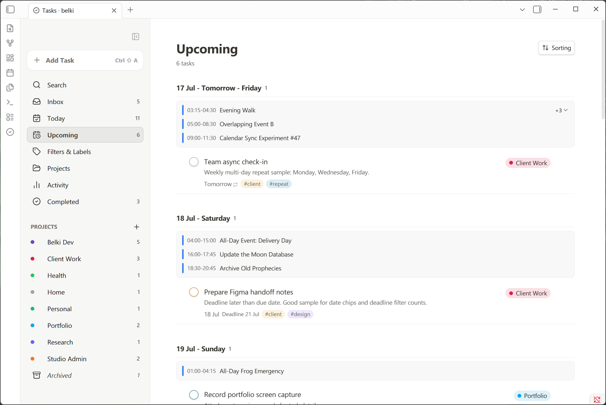
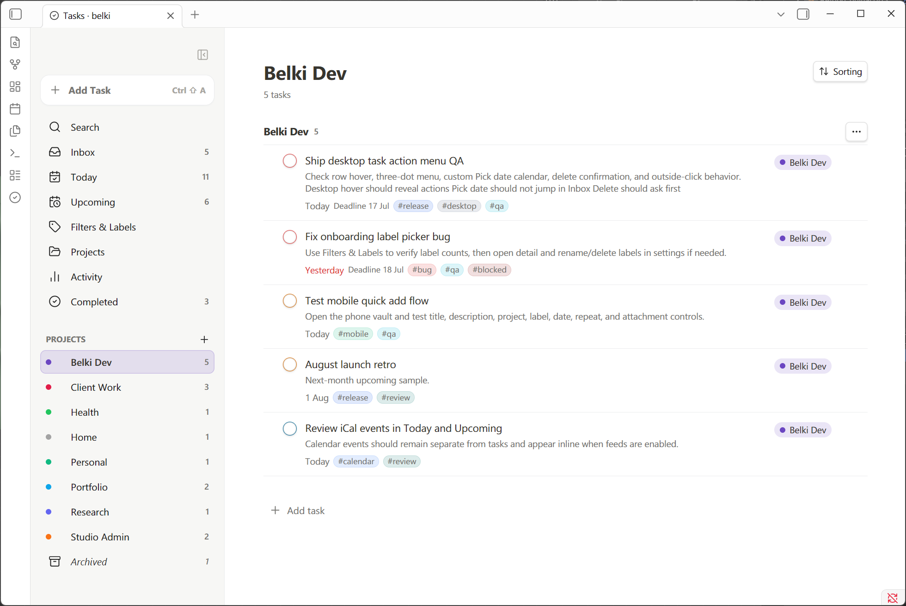
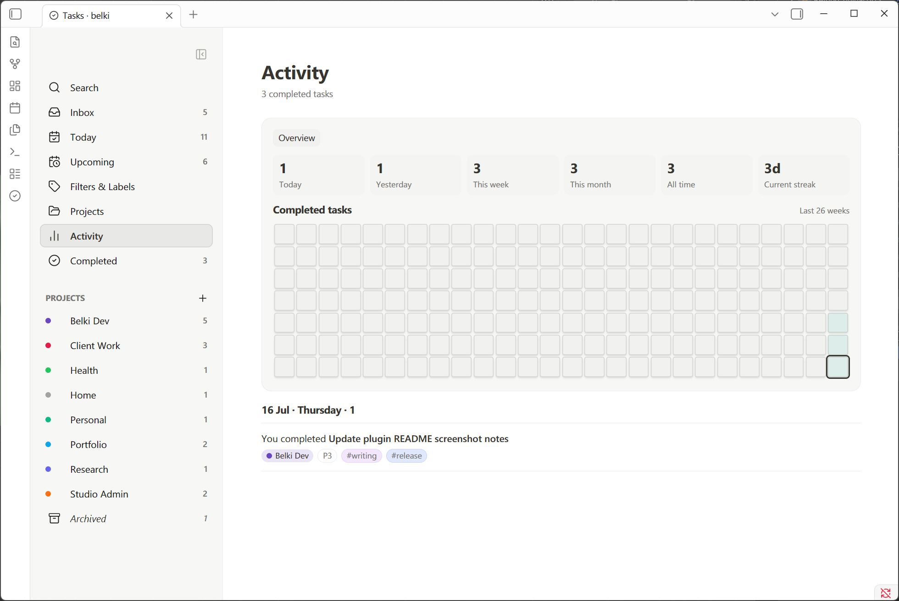

<p align="center">
  
</p>

<h1 align="center">belki</h1>

<p align="center">
  A calm Todoist-like task manager for Obsidian.<br>
  Tasks stay inside your vault as local Markdown files.
</p>

<p align="center">
  <a href="https://community.obsidian.md/plugins/belki">Community plugin</a>
  ·
  <a href="https://github.com/aribuga/obsidian-belki-tasks/releases">Releases</a>
  ·
  <a href="docs/README.md">Docs</a>
</p>

---

belki is a Todoist-inspired task manager that lives inside your Obsidian vault. Your tasks are stored as plain Markdown files you own. Optional read-only calendar subscriptions never turn events into belki tasks or write event data into task Markdown files.

belki aims to sit between lightweight checkbox-based task plugins and heavier task-note systems: structured enough to work as a real task manager, but small enough to stay calm and easy to use.

> belki is **not** a Todoist integration. It does not connect to Todoist.

---

## Screenshots

<p align="center">
  
  
</p>

<p align="center">
  
</p>

<p align="center">
  
  
</p>

<p align="center">
  
</p>

---

## Features

### Views

- **Inbox** — tasks without a project.
- **Today** — today's tasks, overdue tasks, and optional read-only calendar events.
- **Upcoming** — future tasks grouped by date, plus optional calendar-only dates.
- **Projects** — all projects or one focused project.
- **Filters & Labels** — browse by priority, date, label, or saved smart filters.
- **Activity** — completed-task stats and a 26-week activity heatmap.
- **Completed** — completed tasks grouped by completion date.
- **Search** — quick overlay search across task title, description, project, and labels.
- **Daily Notes** — show completed tasks for a daily note in a belki panel or `belki-completed` code block, with optional auto-insert.

### Task Management

- Add tasks from the board, the desktop floating composer, the mobile full-screen composer, or the command palette with `belki: Quick Add Task`.
- Use the default `Cmd/Ctrl + Shift + A` shortcut for Quick Add. In an active desktop belki view it opens the contextual composer; outside belki and on mobile it opens the global Quick Add modal.
- The desktop sidebar Add Task button shows the current Obsidian shortcut assignment when one exists.
- Edit title, description, project, priority, due date, deadline, labels, repeat rule, and attachments.
- Complete, uncomplete, reschedule, move, duplicate, and delete tasks.
- Reschedule visible overdue tasks in bulk from the Overdue section.
- Deletion asks for confirmation, including a parent-task warning when direct sub-tasks are involved.
- Use `#label` and `//project` in the title field while adding a task.
- Use wikilinks such as `[[Project brief]]` in task titles and descriptions.
- Sort by Smart, Due date, Priority, Deadline, Created date, Project, or Alphabetical.

### Sub-tasks

- Add sub-tasks from the parent task detail view.
- Parent task rows show a sub-task completion counter.
- Click the counter to expand an inline sub-task preview in the main task list.
- Complete sub-tasks directly from the preview.
- Reorder sub-tasks in the task detail view on desktop.
- Sub-tasks stay hidden from top-level views to avoid duplication.

### Recurring Tasks

- Daily, weekly, monthly, yearly, and custom repeat rules.
- Calendar-based or completion-based repeats.
- Weekly repeats can target multiple weekdays.
- Recurring tasks advance to the next occurrence when completed.
- Use **Complete permanently** to finish a recurring task.

### Projects, Labels, and Priority

- Create, rename, archive, delete, and color projects.
- Choose a project color while creating a project, or use Auto.
- Rename or delete labels without deleting tasks.
- Customize project and label colors in settings.
- Priority levels use a Todoist-like model: Priority 1, Priority 2, Priority 3, and default Priority 4.
- Priority is shown subtly on the completion circle.

### Attachments

- Attach files to tasks.
- Image attachments show inline previews and a lightbox.
- Other files show as compact file rows.
- Attachments are stored inside your vault.
- Duplicating a task copies attachments into the duplicate task's own attachment folder instead of sharing the original files.

### Mobile

- Responsive single-column mobile layout.
- Full-screen mobile task composer.
- Mobile task detail screen with back navigation.
- Mobile-friendly date picker and repeat controls.
- Task action menu includes Move to Today, Move to Tomorrow, Pick date, Clear date, Duplicate task, and Delete task.
- Mobile keeps the global Quick Add flow rather than using the desktop floating composer.

### Optional Integrations

- Multiple iCal calendar subscription events can appear read-only inline inside Today and Upcoming.
- Google Calendar, Apple/iCloud Calendar, and other HTTPS or `webcal://` iCal feeds are supported when they expose a valid iCal feed URL.
- No Calendar page or sidebar item is added.
- Calendar events are not stored as belki tasks and are not written to task Markdown files.
- Calendar subscriptions are read-only. belki does not create, edit, delete, import, export, or two-way sync calendar events.
- See [Calendar Subscriptions](docs/calendar-subscriptions.md) for setup and security details.

---

## How It Stores Tasks

belki creates a data folder in your vault. The default location is:

```text
_belki_files/
├─ Data/
│  └─ YYYY-MM.md
└─ Attachments/
   └─ <task-id>/
```

Each task is a Markdown list item with metadata:

```markdown
- [ ] Write portfolio case study draft
  id:: task-example
  created:: 2026-07-05
  due:: 2026-07-08
  deadline:: 2026-07-10
  project:: Client Work
  priority:: P2
  description:: Keep it short and visual.
  labels:: writing, portfolio
```

Tasks without a real project simply omit `project::` and appear in Inbox. Completed tasks use `[x]` and include a `completed::` date. The data folder path is configurable in settings.

See [Markdown storage](docs/markdown-storage.md) for full details.

---

## Obsidian Search and Excluded Files

belki stores task data as local Markdown files in the configurable data folder, `_belki_files/` by default. Since these are real vault files, users who do not want belki task data to appear in Obsidian search, graph, or unlinked mentions should add `_belki_files/` to:

> Obsidian Settings → Files and links → Excluded files

belki itself only reads its configured data folder and does not scan the whole vault. Future vault-wide checklist import should respect Obsidian excluded folders.

---

## Installation

### Community Plugins

1. Open Obsidian Settings → Community plugins.
2. Click **Browse** and search for `belki`.
3. Install and enable the plugin.
4. Run the command `belki: Open`.

Community listing: [community.obsidian.md/plugins/belki](https://community.obsidian.md/plugins/belki)

### Manual Installation

1. Download `manifest.json`, `main.js`, and `styles.css` from a [GitHub release](https://github.com/aribuga/obsidian-belki-tasks/releases).
2. Create this folder inside your vault:
   ```text
   .obsidian/plugins/belki/
   ```
3. Copy the three files into that folder.
4. Reload Obsidian.
5. Enable **belki** in Settings → Community plugins.
6. Run the command `belki: Open`.

---

## Quick Start

1. Install and enable belki.
2. Run `belki: Open` from the command palette.
3. Click **+ Add task** or run `belki: Quick Add Task`.
4. Add a title, date, project, label, priority, or repeat rule.
5. Tasks with no project land in **Inbox**.

See [Getting started](docs/getting-started.md) for a walkthrough.

---

## Documentation

| Page | Description |
|---|---|
| [Getting started](docs/getting-started.md) | Install and take your first steps |
| [Tasks](docs/tasks.md) | Creating, editing, and completing tasks |
| [Projects and Inbox](docs/projects-and-inbox.md) | How projects and Inbox work |
| [Sub-tasks](docs/subtasks.md) | Adding and managing sub-tasks |
| [Recurring tasks](docs/recurring-tasks.md) | Repeat rules and behavior |
| [Labels and priorities](docs/labels-and-priorities.md) | Labeling tasks and setting priority |
| [Sorting and filtering](docs/sorting-and-filtering.md) | Sorting, grouping, and filtering |
| [Attachments](docs/attachments.md) | Adding files and images to tasks |
| [Activity](docs/activity.md) | Completed task history and stats |
| [Daily Notes](docs/daily-notes.md) | Show completed tasks for a daily note date |
| [Mobile](docs/mobile.md) | Using belki on mobile |
| [Settings](docs/settings.md) | Configuration options |
| [Markdown storage](docs/markdown-storage.md) | How belki stores task data |
| [FAQ](docs/faq.md) | Common questions |

---

## Development

```bash
pnpm install
pnpm run build
```

During development:

```bash
pnpm run dev
```

Build output is written to:

- `main.js`
- `styles.css`
- `manifest.json`

---

## Release Checklist

- Update `manifest.json`, `package.json`, and `versions.json`.
- Run `pnpm install --frozen-lockfile`.
- Run `pnpm run typecheck`, `pnpm test`, and `pnpm run build`.
- Confirm `manifest.json`, `main.js`, and `styles.css` are present.
- Create a GitHub release whose tag exactly matches the manifest version.
- Upload `manifest.json`, `main.js`, and `styles.css` as release assets.

See [RELEASE.md](RELEASE.md) for the full process.

---

## Privacy and Network Usage

belki does not add telemetry and does not require an account. It reads and writes task data only inside its configured vault data folder.

If you enable optional calendar subscriptions, belki fetches only the iCal feed URLs you configure. Those feed URLs are stored locally in plugin settings, masked in the settings UI, and should be treated as private secrets when they contain calendar access tokens.

---

## Planned Improvements

These are directions being explored, not commitments:

- Natural language date parsing (`tomorrow`, `next Friday`, `in 3 days`).
- Standalone recurring task refinements.
- Vault-wide checklist import that respects Obsidian excluded files and folders.
- Better lightweight GTD-style workflows such as Inbox, Next Actions, Waiting, Someday/Maybe, and Projects.
- Minimal, understandable settings with clear defaults and optional advanced workflows.

---

## Contributing and Feedback

Bug reports and feature requests are welcome at [github.com/aribuga/obsidian-belki-tasks/issues](https://github.com/aribuga/obsidian-belki-tasks/issues).

---

## Author

Created by Yasin Aribuga.

---

## License

MIT. See [LICENSE](LICENSE).
