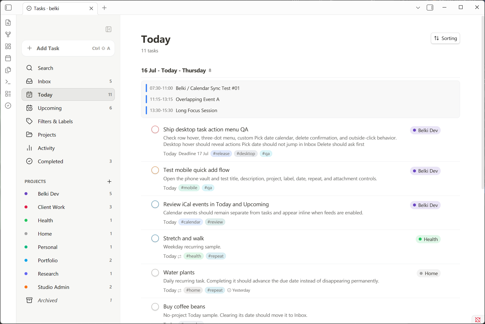
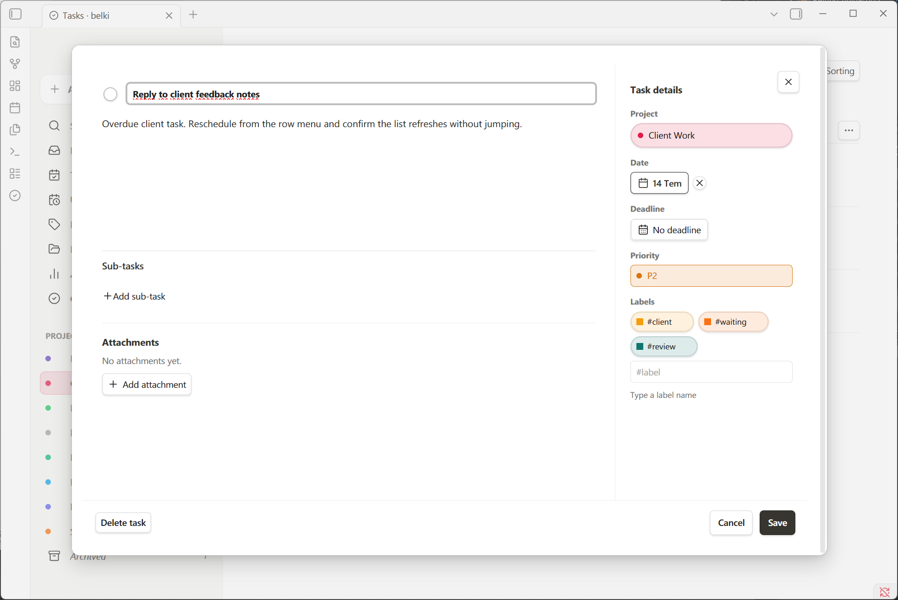
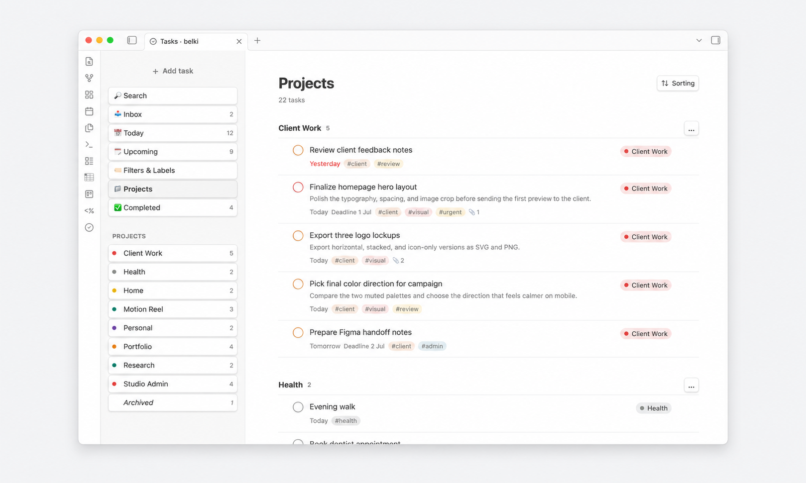
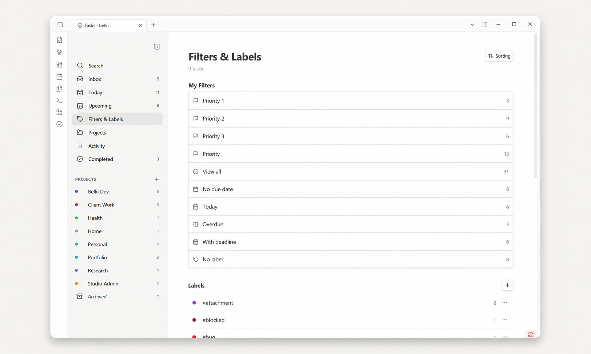

<p align="center">
  
</p>

<h1 align="center">belki</h1>

<p align="center">
  A calm Todoist-like task manager for Obsidian.<br>
  Tasks stay inside your vault.
</p>

---

belki is a Todoist-inspired task manager that lives entirely inside your Obsidian vault. There is no account, no external service, and no sync. Your tasks are stored as plain Markdown files you own.

It sits between simple checkbox plugins and heavy task-note systems: structured enough to work as a real task manager, small enough to stay calm.

> belki is **not** a Todoist integration. It does not connect to Todoist or any external service.

---

## Screenshots

<p align="center">
  
  
</p>

<p align="center">
  
  
</p>

---

## Features

**Views**
- Inbox — tasks without a project
- Today — due today + overdue tasks
- Upcoming — tasks grouped by date
- Projects — all projects or a single project, flat or grouped
- Filters & Labels — browse by priority, date, or label
- Completed — done tasks grouped by completion date
- Search — full-text search across all tasks

**Task management**
- Add tasks from a quick-add composer or via command
- Edit title, description, project, priority, due date, deadline, labels, and attachments
- Complete, uncomplete, reschedule, and delete tasks
- Drag tasks onto a project or date group to update them
- Wikilinks work inside task titles and descriptions
- Type `#label` or `//project` in the task title to set them from the keyboard

**Sub-tasks**
- Add sub-tasks inline from the parent task detail view
- Sub-tasks show a completion counter on the parent task card
- Completing a sub-task moves it to the bottom of the list
- Sub-tasks are hidden from top-level views to avoid duplication

**Recurring tasks**
- Repeat rules: daily, weekly, monthly, and custom
- Completion-based or calendar-based repeat modes

**Projects**
- Create, rename, archive, and color projects
- Group by label or priority inside a project view
- Sub-tasks inherit the parent task's project

**Labels and priorities**
- Labels with customizable colors
- Four priority levels: P1 through P4
- Priority shown on the task completion circle

**Sorting**
- Smart, Due date, Priority, Deadline, Created date, Project, Alphabetical

**Grouping** (project views only)
- Group by: None, Label, Priority

**Attachments**
- Images show inline previews in the task detail view
- Other files show as compact rows
- Attachments are stored inside your vault

**Mobile**
- Full mobile layout support

**Storage**
- All task data stored as Markdown in your vault
- No external service, no account, no sync

---

## Why belki?

- You want Todoist-style task management without a Todoist account
- You want your tasks to stay inside your vault as readable Markdown
- You want projects, labels, priorities, and due dates without the weight of a full note-based task system
- You want something that works well on desktop and mobile

---

## How it stores tasks

belki creates a data folder in your vault. The default location is:

```
_belki_files/
├─ Data/
│  └─ YYYY-MM.md     ← tasks stored by month
└─ Attachments/
   └─ <task-id>/     ← attachments per task
```

Each task is a Markdown list item with metadata:

```markdown
- [ ] Write portfolio case study draft
  id:: abc123
  created:: 2026-06-29
  due:: 2026-07-01
  deadline:: 2026-07-03
  project:: Client Work
  priority:: P2
  description:: Keep it short and visual.
  labels:: writing, portfolio
```

Completed tasks use `[x]` and include a `completed::` date. The folder path is configurable in settings.

See [Markdown storage](docs/markdown-storage.md) for full details.

---

## Installation

### Community plugins

1. Open Obsidian Settings → Community plugins.
2. Click **Browse** and search for `belki`.
3. Install and enable the plugin.
4. Run the command `belki: Open`.

### Manual installation

1. Download `manifest.json`, `main.js`, and `styles.css` from a [GitHub release](https://github.com/aribuga/obsidian-belki-tasks/releases).
2. Create this folder inside your vault:
   ```
   .obsidian/plugins/belki/
   ```
3. Copy the three files into that folder.
4. Reload Obsidian.
5. Enable **belki** in Settings → Community plugins.
6. Run the command `belki: Open`.

---

## Quick start

1. Install and enable belki.
2. Run `belki: Open` from the command palette.
3. Click **+ Add task** to create your first task.
4. Set a due date, project, or priority from the task detail view.
5. Tasks with no project land in **Inbox**. Assign a project to move them.

See [Getting started](docs/getting-started.md) for a walkthrough.

---

## Documentation

| Page | Description |
|---|---|
| [Getting started](docs/getting-started.md) | Install and take your first steps |
| [Tasks](docs/tasks.md) | Creating, editing, and completing tasks |
| [Projects and Inbox](docs/projects-and-inbox.md) | How projects and Inbox work |
| [Sub-tasks](docs/subtasks.md) | Adding and managing sub-tasks |
| [Recurring tasks](docs/recurring-tasks.md) | Repeat rules and behavior |
| [Labels and priorities](docs/labels-and-priorities.md) | Labeling tasks and setting priority |
| [Sorting and filtering](docs/sorting-and-filtering.md) | Sorting, grouping, and filtering |
| [Attachments](docs/attachments.md) | Adding files and images to tasks |
| [Mobile](docs/mobile.md) | Using belki on mobile |
| [Settings](docs/settings.md) | Configuration options |
| [Markdown storage](docs/markdown-storage.md) | How belki stores task data |
| [FAQ](docs/faq.md) | Common questions |

---

## Planned improvements

These are directions being explored, not commitments:

- Natural language date parsing (`tomorrow`, `next Friday`)
- Vault-wide checklist import
- Lightweight GTD-style workflows (Next, Waiting, Someday)
- Additional group-by options in non-project views

---

## Contributing and feedback

Bug reports and feature requests are welcome at [github.com/aribuga/obsidian-belki-tasks/issues](https://github.com/aribuga/obsidian-belki-tasks/issues).

---

## License

MIT. See [LICENSE](LICENSE).

---

## Maintenance note

The GitHub social preview image is stored at `assets/brand/belki-social-preview.png`. To update the social preview shown on GitHub, upload this file manually at:

> GitHub repo → Settings → Social preview
